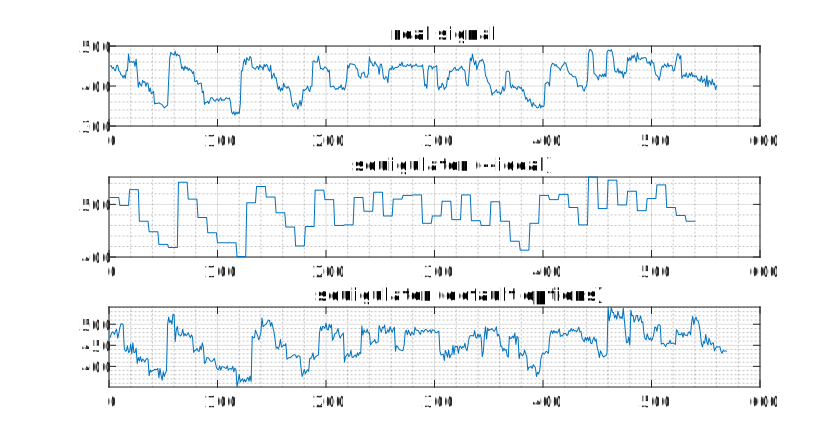

# squigulator

*squigulator* is a tool for simulating nanopore raw signal data. It is under development and there could be interface changes and changes to default parameters. Do not hesitate to open an [issue](https://github.com/hasindu2008/squigulator) if you found a bug, something is not clear or for any feature requests.

*squigulator* uses traditional pore models and gaussian noise for simulation. Due to simplicity, simulation would not be perfect, but takes miniscule effort to setup and run. Generating 100,000 reads (~1 Gbases) from human genome using *squigulator* takes ~5 minutes with ~3 GB of RAM (8 CPU threads). For ~30X from the human genome (~9M reads, ~90Gbases) with 32 CPU threads, *squigulator* takes ~1 hour.

Reads directly extracted from the reference genome are simulated without any mutations/variants. If you want to have variants in your simulated data, you can first apply a set of variants to the reference using [bcftools](http://www.htslib.org/download/) and use that as the input to the *squigulator*.

Publication: [https://doi.org/10.1101/gr.278730.123](https://genome.cshlp.org/content/34/5/778.full?sid=cd2c8aec-be46-4c9e-885c-8452ac069f64) <br/>
Preprint: [https://www.biorxiv.org/content/10.1101/2023.05.09.539953v1](https://www.biorxiv.org/content/10.1101/2023.05.09.539953v1)<br/>
SLOW5 ecosystem: [https://hasindu2008.github.io/slow5](https://hasindu2008.github.io/slow5)<br/>



[](https://github.com/hasindu2008/squigulator/releases)
[](https://anaconda.org/bioconda/squigulator)
[](https://github.com/hasindu2008/squigulator/actions/workflows/c-cpp.yml)


Please cite the following in your publications when using *squigulator*:

> Gamaarachchi, H., Ferguson, J. M., Samarakoon, H., Liyanage, K., & Deveson, I. W. (2024). Simulation of nanopore sequencing signal data with tunable parameters. Genome Research, 34(5), 778-783.

```
@article{gamaarachchi2023squigulator,
  title={Squigulator: simulation of nanopore sequencing signal data with tunable noise parameters},
  author={Gamaarachchi, Hasindu and Ferguson, James M and Samarakoon, Hiruna and Liyanage, Kisaru and Deveson, Ira W},
  journal={bioRxiv},
  pages={2023--05},
  year={2023},
  publisher={Cold Spring Harbor Laboratory}
}
```

## Background story

*squigulator* started as *ssssim* (Stupidly Simple Signal Simulator). For an experiment, [kisarur](https://github.com/kisarur) wanted some simulated data. After [hiruna72](https://github.com/hiruna72) trying ~3 days to get an existing simulator installed (dependency and compatibility issues), I thought that writing a simple tool from scratch is easier. Indeed, that is when writing BLOW5 files. Writing over complicated formats like FAST5 or POD5 would consume months and I would not think about writing a simulator in the first place then.

After getting the basic *ssssim* implemented in ~8 hours and successfully basecalling using [buttery-eel](https://github.com/Psy-Fer/buttery-eel), I realised that it has worked much better than anticipated. Then, I decided to extend it with different features and options. The result is *sigsim* which was eventually named as *squigulator*, a cool name suggested by [IraDeveson](https://github.com/IraDeveson).

## Installation

For x86-64 Linux, you can use the precompiled binaries under [releases](https://github.com/hasindu2008/squigulator/releases):

```
VERSION=0.4.0
wget https://github.com/hasindu2008/squigulator/releases/download/v${VERSION}/squigulator-v${VERSION}-x86_64-linux-binaries.tar.gz
tar xf squigulator-v${VERSION}-x86_64-linux-binaries.tar.gz  && cd squigulator-v${VERSION}
./squigulator --help
```

To build squigulator you need a C compiler that supports C99 standard (with X/Open 7 POSIX 2008 extensions):

```
sudo apt-get install zlib1g-dev   #install zlib development libraries
git clone https://github.com/hasindu2008/squigulator # alternatively download a release tarball from under https://github.com/hasindu2008/squigulator/releases/ and extract
cd squigulator
make
```

The commands to install zlib __development libraries__ on some popular distributions :
```sh
On Debian/Ubuntu : sudo apt-get install zlib1g-dev
On Fedora/CentOS : sudo dnf/yum install zlib-devel
On OS X : brew install zlib
```

## Usage

The simplest command to generate reads:
```
squigulator [OPTIONS] ref_genome.fa -o out_signal.blow5 -n NUM_READS
```

By default, DNA PromethION reads (R9.4.1) will be simulated. Specify the `-x STR` option to set a different profile from the following available pre-sets (see [here](docs/profile.md) for more info).
- `dna-r9-min`: genomic DNA on MinION R9.4.1 flowcells
- `dna-r9-prom`: genomic DNA on PromethION R9.4.1 flowcells
- `rna-r9-min`: direct RNA on MinION R9.4.1 flowcells
- `rna-r9-prom`: direct RNA on PromethION R9.4.1 flowcells
- `dna-r10-min`: genomic DNA on MinION R10.4.1 flowcells
- `dna-r10-prom`: genomic DNA on PromethION R10.4.1 flowcells
- `rna004-min`: direct RNA on MinION RNA004 flowcells
- `rna004-prom`: direct RNA on promethION RNA004 flowcells

If a genomic DNA profile is selected, the input reference must be the **reference genome in *FASTA* format**. *squigulator* will randomly sample the genome from a uniform distribution and generate reads whose lengths are from a gamma distribution (based on `-r`). If a direct RNA profile is selected, the input reference must be the **transcriptome in *FASTA* format**. For RNA, *squigulator* will randomly pick transcripts from a uniform distribution and the whole transcript length is simulated.

You can basecall the generated raw signal directly from the [BLOW5 format](https://www.nature.com/articles/s41587-021-01147-4) using the SLOW5 Guppy wrapper called [buttery-eel](https://github.com/Psy-Fer/buttery-eel) or our fork of [dorado basecaller](https://github.com/hiruna72/dorado/releases/tag/v0.0.1).  Alternatively, if you love FAST5 that much, use [slow5tools](https://github.com/hasindu2008/slow5tools) to convert the BLOW5 to FAST5 and then use original Guppy basecaller.

Generated read IDs encode the true mapping positions in a format like `S1_33!chr1!225258409!225267761!-`, which is compatible with [*mapeval* command in *paftools.js* under Minimap2 repository](https://github.com/lh3/minimap2/blob/master/misc/README.md#evaluation). Mapping positions are 0-based (BED like) coordinates.

Visit the [manual page](docs/man.md) for details of each and every option.

## Examples

DNA examples:

```
# generate 150,000 PromethION DNA reads from a reference genome
squigulator hg38noAlt.fa -x dna-r9-prom -o reads.blow5 -n 150000

# generate 30,000 MinION ultra-long DNA reads with mean readlength of around 50,000 bases
squigulator hg38noAlt.fa -x dna-r9-min -o reads.blow5 -n 30000 -r 50000

# generate 1000 PromethION DNA reads with perfect signals with no noise
squigulator hg38noAlt.fa -x dna-r9-prom -o reads.blow5 -n 1000 --ideal

# simulate signals for basecalled reads (each complete read will be simulated; not memory optimised yet, will load the while basecalled.fq to memory first)
squigulator basecalled.fq -x dna-r9-prom -o reads.blow5 --full-contigs

# simulate R10 chemistry PromethION DNA reads at 30X fold coverage
squigulator hg38noAlt.fa -x dna-r10-prom -o reads.blow5 -f 30
```

RNA examples:
```
# generate 4000 PromethION direct RNA reads from a transcriptome while including the adaptor and polyA tail
squigulator gencode.v40.transcripts.fa -x rna-r9-prom -o reads.blow5 -n 4000 --prefix

# simulate signals for basecalled reads (each complete read will be simulated; not memory optimised yet, will load the whole basecalled.fq to memory first)
squigulator basecalled.fq -x dna-r9-prom -o reads.blow5 --full-contigs
```

DNA example with variants that requires [bcftools](http://www.htslib.org/download/):

```
# ploidy 1; coronavirus (reference ~30,000 bases) at ~500X depth with mean readlength of around 300 bases (approximately 30,000*500/300=50,000 reads); apply some variants
bcftools consensus -f nCoV-2019.reference.fasta alpha.vcf -o alpha.fa
# squigulator alpha.fa -x dna-r9-prom -o reads.blow5 -f 500 # before squigulator v0.2: squigulator alpha.fa -x dna-r9-prom -o reads.blow5 -n 50000 -r 300

# ploidy 2; chr22 (reference ~50,000,000 bases) at ~30X depth with mean readlength of around 10,000 bases (approximately 50,000,000*30/10,000=150,000 reads); apply na12878 truthset from genome in a bottle consortium

bcftools consensus -H 1 -f hg38noAlt_chr22.fa na12878_chr22.vcf.gz -o na12878_chr22_1.fa
bcftools consensus -H 2 -f hg38noAlt_chr22.fa na12878_chr22.vcf.gz -o na12878_chr22_2.fa
cat na12878_chr22_1.fa na12878_chr22_2.fa > na12878_chr22.fa
squigulator na12878_chr22.fa -x dna-r9-prom -o reads.blow5 -f 30 #before squigulator v0.2: squigulator na12878_chr22.fa -x dna-r9-prom -o reads.blow5 -n 150000 -r 10000
```

## Acknowledgement

R9 pore-models are from [Nanopolish](https://github.com/jts/nanopolish) and R10 pore-models derived from [here](https://github.com/nanoporetech/kmer_models).
Some code snippets have been taken from [Minimap2](https://github.com/lh3/minimap2), [Samtools](http://samtools.sourceforge.net/).
Kseq from [klib](https://github.com/attractivechaos/klib) is used.

