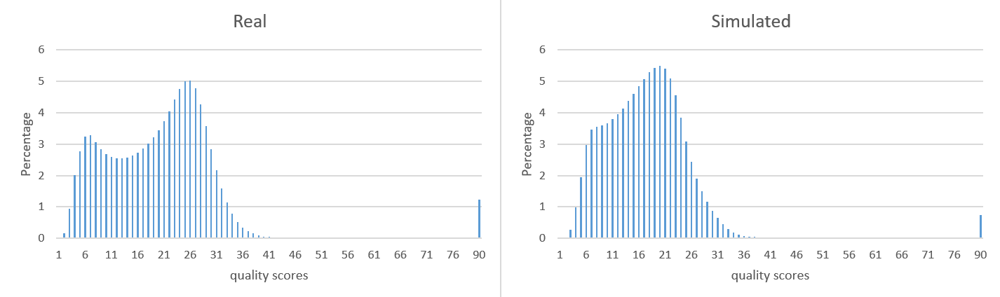
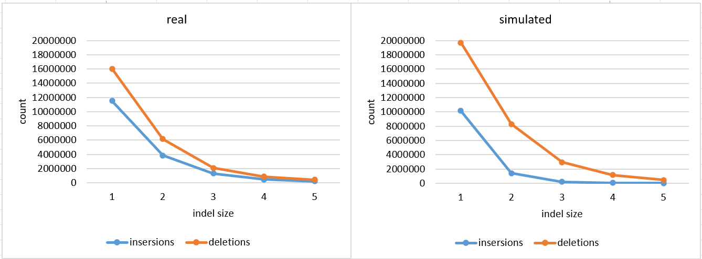
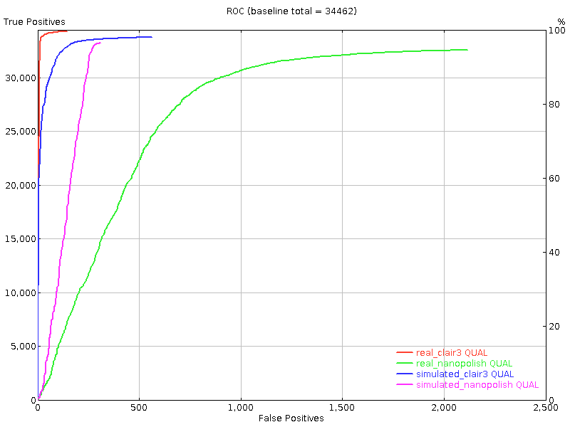
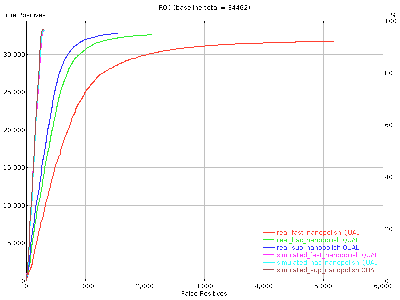
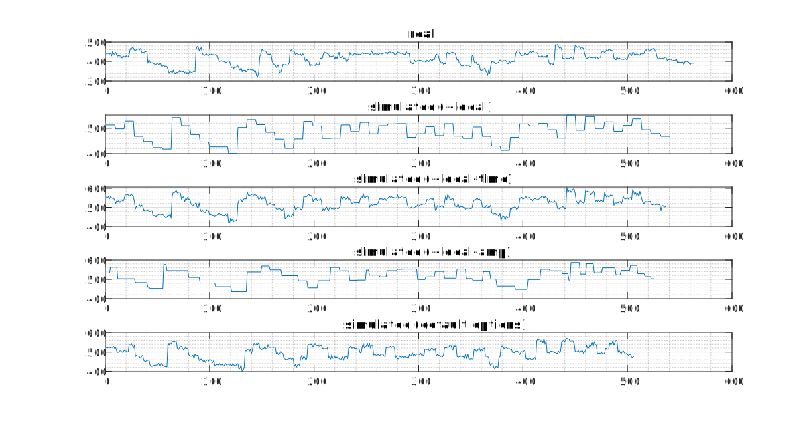
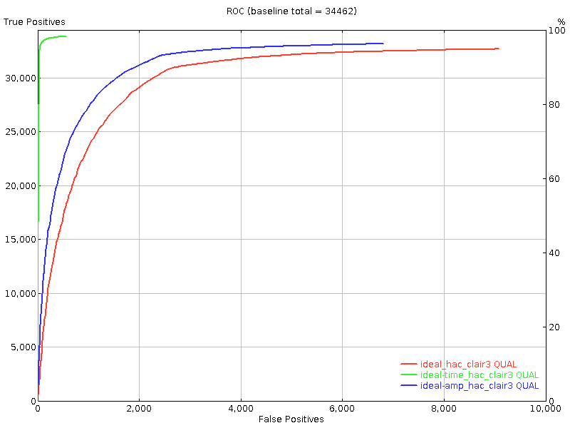
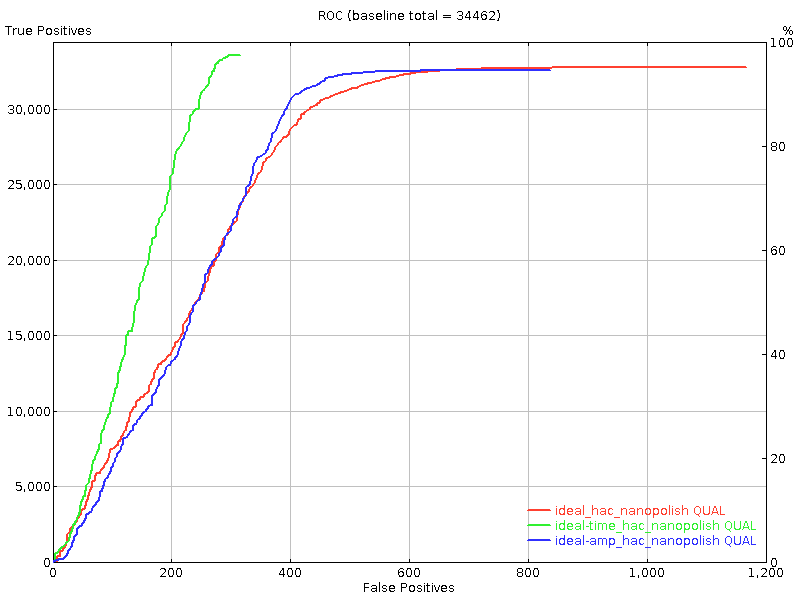
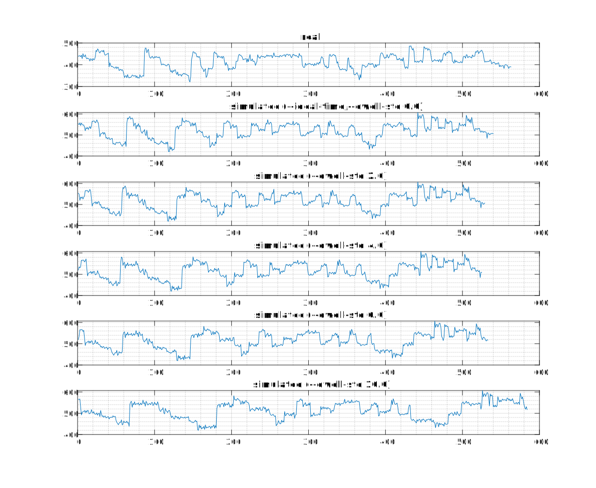
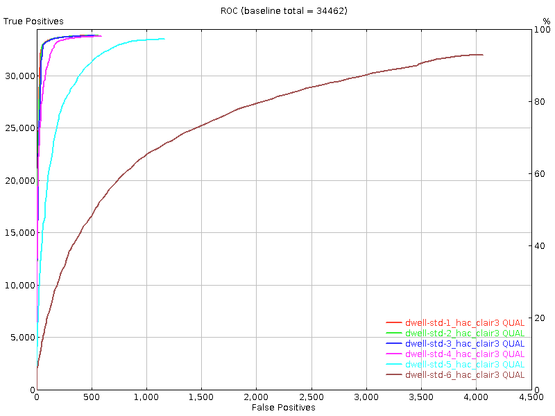
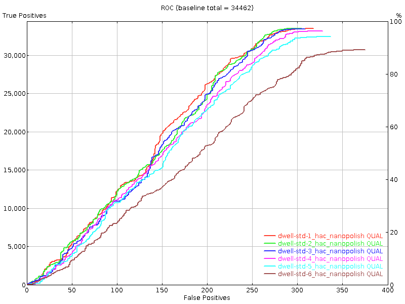

# squigulator evaluation - genomic DNA

**This document is based on very early experiments conducted using commit [2b9f3e886eea16](https://github.com/hasindu2008/squigulator/commit/2b9f3e886eea1601d9f0b2021bcd303ad48005a8) when the tool was under activate development. For more up to date information, please refer to the [squigulator publication](https://genome.cshlp.org/content/34/5/778.full?sid=cd2c8aec-be46-4c9e-885c-8452ac069f64).**

For comparing *squigulator* against real data, reads mapping to the chr22 from a NA12878 dataset sequenced on a PromethION sequencer was used. The extracted dataset had ~135,000 reads whose mean read length was ~10,800 bases (will be referred to as *real*). To simulate reads using *squigulator*, first, a heterozygous NA12878 heterozygous chr22 reference was created by applying NA12878 GIAB variants to chr22 in hg38 reference genome. Then, *squigulator* was executed to generate 135,000 reads at mean read length of 10,800 (will be referred to as *simulated*).  See [Methods](#Methods) for more information.

Both *real* and *simulated* above were basecalled using the high accuracy model. The read length histogram for the basecalled data is given below. Two distributions are not identical, but close enough.


Base-level statistics on the basecalled data obtained using *seqtk fqchk* is as below:

|           | min\_len | max\_len | avg\_len | #bases   | %A   | %C   | %G   | %T   | avgQ | errQ |
| --------- | -------- | -------- | -------- | -------- | ---- | ---- | ---- | ---- | ---- | ---- |
| real      | 129      | 187345   | 10800.21 | 1.46E+09 | 27.7 | 22.2 | 22.3 | 27.8 | 20.1 | 12.3 |
| simulated | 133      | 80092    | 10480.35 | 1.41E+09 | 26.1 | 23.9 | 23.6 | 26.5 | 15.7 | 11   |

Histogram of the quality scores of the basecalls are as below:


Again, these are not identical, but similar enough.

Then, the basecalled reads were aligned to hg38 using *Minimap2*. The BLAST-like identity scores are as below:

|           | mean      | std         | q1          | median     | q3       | mad        |
|-----------|-------------|-------------|------------|----------|------------|------------|
| real      | 0.889667313 | 0.096932195 | 0.85664225 | 0.93342  | 0.95880425 | 0.048323864 |
| simulated | 0.936279784 | 0.009512705 | 0.930384   | 0.935548 | 0.941324   | 0.008072016 |

Median and quartile 3 are similar. However, other values are a bit off, which I am yet to figure out why.


Statistics of the BAM file obtained using *samtools stats* is as below:

|                      | real                 | simulated     |
|----------------------|---------------|------------|
| sequences            | 135,083       | 134,999       |
| reads mapped         | 134,001       | 134,985       |
| reads unmapped       | 1,082         | 14            |
| reads MQ0            | 661           | 150           |
| total length         | 1,458,924,348 | 1,414,836,343 |
| bases mapped (cigar) | 1,491,898,469 | 1,414,191,336 |
| mismatches           | 154,930,196   | 93,894,710    |
| error rate           | 1.04E-01      | 6.64E-02      |
| average length       | 10800         | 10480         |
| maximum length       | 187345        | 80092         |
| average quality      | 20.1          | 17.5          |
| insertions (1-base)  | 11,508,645    | 10,144,286    |
| deletions (1-base)   | 16,023,165    | 19,677,940    |

The count of different sized insertions and deletions based on the alignments in the BAM file are as below:




Then, variant calling was performed using Nanopolish and Clair3 and the ROC curves for the SNPs against the GAIB NA12878 truthset is as below:




## Different basecalling models


All the above experiments were based on high accuracy basecalling. Given below is the comparison of results from variant calling when different basecalling models are used (Clair3 on left and Nanopolish on right).




## parameter exploration

Above experiments were with *squigulator* using default options for noise. *squigulator* allows generating signals with different types noise: 1, no noise in both amplitude and time domains (*ideal*); 2, no noise in the time domain but with noise in the amplitude domain; and, 3, no noise in the amplitude domain but with noise in time domain  (*ideal-amp*).  Figure below pictorially depict those three.



The effect of noise on variant calling is depicted in the figures below (Clair3 on left and Nanopolish on right). High accuracy basecalling was used for all the cases here.



*squigulator* also allows the user to control the amount of noise in the time domain using the *--dwell-std* parameter. Increasing this parameter increases the time domain noise (or the amount of time warping) as shown in the below example.



The effect of different amounts of noise in the time domain on variant calling is as below (Clair3 on left and Nanopolish on right):




## Miscellaneous

*squigulator* does not simulate methylation. So a methylation calling ideally should give 0 methylation. *f5c* was excuted on the simulated dataset and it was as expected (median methylation frequency 0, mean methylation frequency 0.0017).


# Methods

The real dataset used is an NA12878 PromethION dataset available at [SRA](https://www.ncbi.nlm.nih.gov/sra?linkname=bioproject_sra_all&from_uid=744329). For details of this dataset see [supplementary table 1](https://static-content.springer.com/esm/art%3A10.1038%2Fs41587-021-01147-4/MediaObjects/41587_2021_1147_MOESM1_ESM.pdf) under [SLOW5 publication](https://www.nature.com/articles/s41587-021-01147-4). Real dataset was converted to BLOW5, basecalled using buttery-eel, aligned using minimap2 to hg38noAlt reference and the reads mapping to chr22 was extracted using samtools view.

NA12878 chr22 heterozygous genome was generated by extracting chr22 from hg38 genome and applying NA12878 high confidence variants from GIAB using bcftools as in this [example](https://github.com/hasindu2008/squigulator#examples). Then squigulator was used to generate 135,000 simulated reads with mean length of 10,800 bases as:
```
squigulator na12878_chr22.fa -o reads.blow5 -q reads.fa -n 135000 -r 10800 -x dna-r9-prom -t 16 -K 4096
```

The generated BLOW5 file was basecalled using buttery-eel and was aligned using Minimap2 to hg38noAlt reference. Nanopolish variant calling was performed with `-q cpg --fix-homopolymers` flags. Clair3 variant calling was performed using r941_prom_sup_g5014 model. Variant evaluation was performed using rtg eval against GIAB NA12878 high confidence truth-set (same used for simulation) with QUAL field as the `--vcf-score-field`.


## Tools used

- squigulator (commit c581be5)
- slow5tools v0.6.0
- Buttery-eel v0.0.1 on Guppy v6.0.6
- Minimap2 v2.17
- Samtools v1.9
- Bcftools v1.16
- Datamash v1.2
- Nanopolish v0.14.0
- Clair3 v0.1-r11
- RTG Tools v3.11
- parallel
- seqtk
- f5c 1.1
