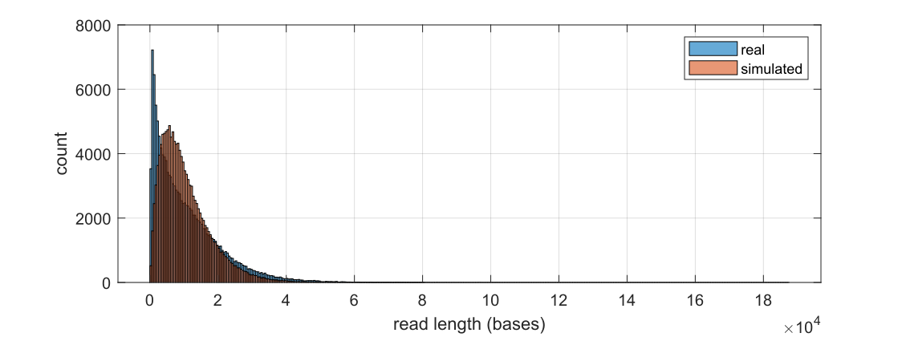
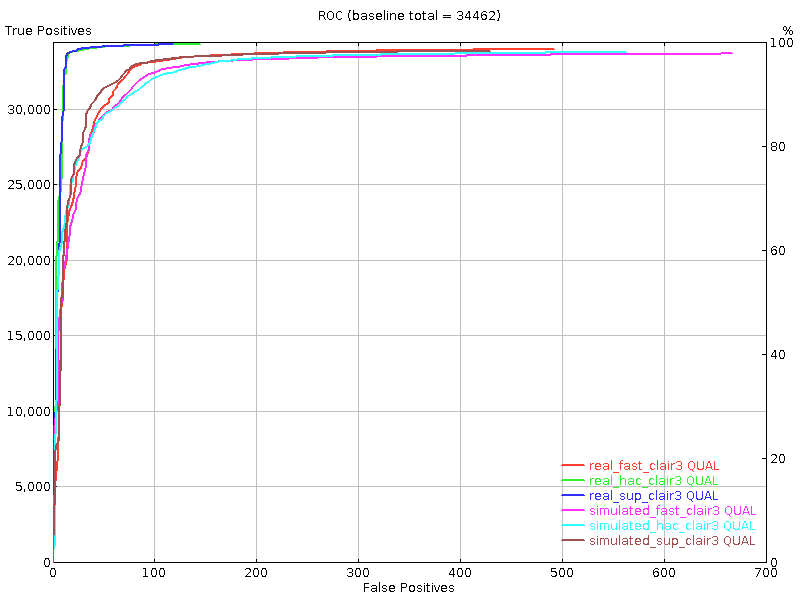

# squigulator evaluation - genomic DNA


Using NA12878 chr22. In realdata extracted the reads that mapped to chr22 in a prom sample. Mean read length was ~10800 and number of reads was ~135000

Created an na12878 chr22 heterozygous reference by applying GIAB VCF to hg38. Used squigulator to generate reads that match the number and read lengths in real data. The histogram is below - not indetical, but close enough.



For above basecalling was done with high accuracy.

Base-level stats from seqtk fqchk:
|           | min\_len | max\_len | avg\_len | #bases   | %A   | %C   | %G   | %T   | avgQ | errQ |
| --------- | -------- | -------- | -------- | -------- | ---- | ---- | ---- | ---- | ---- | ---- |
| real      | 129      | 187345   | 10800.21 | 1.46E+09 | 27.7 | 22.2 | 22.3 | 27.8 | 20.1 | 12.3 |
| simulated | 133      | 80092    | 10480.35 | 1.41E+09 | 26.1 | 23.9 | 23.6 | 26.5 | 15.7 | 11   |

Qscore histogram:


Now after minimap2 alignment, BLAST-like identity scores.


|           | mean      | std         | q1          | median     | q3       | mad        |
|-----------|-------------|-------------|------------|----------|------------|
| real      | 0.889667313 | 0.096932195 | 0.85664225 | 0.93342  | 0.95880425 | 0.048323864 |
| simulated | 0.936279784 | 0.009512705 | 0.930384   | 0.935548 | 0.941324   | 0.008072016 |


Stats from samtools stats:

|                      | real                 | simulated     |
|----------------------|---------------|
| sequences            | 135,083       | 134,999       |
| reads mapped         | 134,001       | 134,985       |
| reads unmapped       | 1,082         | 14            |
| reads MQ0            | 661           | 150           |
| total length         | 1,458,924,348 | 1,414,836,343 |
| bases mapped (cigar) | 1,491,898,469 | 1,414,191,336 |
| mismatches           | 154,930,196   | 93,894,710    |
| error rate           | 1.04E-01      | 6.64E-02      |
| average length       | 10800         | 10480         |
| maximum length       | 187345        | 80092         |
| average quality      | 20.1          | 17.5          |
| insertions (1-base)  | 11,508,645    | 10,144,286    |
| deletions (1-base)   | 16,023,165    | 19,677,940    |


Now some variant calling fun. SNPs.


For all the about HAC basecalling was used.

## Different basecalling models

 


## parameter exploration

Using HAC for all.

Ideal and with noise


 


Amount of time-domain noise


 


## Misc

Methcalling?
Median methylation frequency 0 and mean 0.0017


# Methods

The real dataset used is an NA12878 PromethION dataset available at [SRA](https://www.ncbi.nlm.nih.gov/sra?linkname=bioproject_sra_all&from_uid=744329).
For details of this dataset see the [SLOW5 publication](https://www.nature.com/articles/s41587-021-01147-4) under [supplementary table 1](https://static-content.springer.com/esm/art%3A10.1038%2Fs41587-021-01147-4/MediaObjects/41587_2021_1147_MOESM1_ESM.pdf).

Real dataset was converted to BLOW5, basecalled using buttery-eel, aligned using minimap2 to hg38noAlt reference and the reads mapping to chr22 was extracted using Samtools view.

NA12878 chr22 heterezygous genome was generated by extracting chr22 from hg38 genome and applying NA12878 high confidence variants from GIAB using bcftools as in this [example](https://github.com/hasindu2008/squigulator#examples). Then squigulator was used to generate 135000 simulated reads with mean length of 10800 bases as:
```
squigulator na12878_chr22.fa -o reads.blow5 -q reads.fa -n 135000 -r 10800 -x dna-r9-prom -t 16 -K 4096
```
The generated BLOW5 file was basecalled using buttery-eel and was aligned using Minimap2 to hg38noAlt reference.

Nanopolish variant calling was performed with `-q cpg --fix-homopolymers` flags.
Clair3 variant calling was performed using r941_prom_sup_g5014 model.

Variant evaluation was performed using rtg eval against GIAB NA12878 high confidence truthset (same used for simulation) with QUAL field as the `--vcf-score-field`.


## Tools used
- squigulator (commit c581be5)
- slow5tools v0.6.0
- Buttery-eel v0.0.1 on Guppy v6.0.6
- Minimap2 v2.17
- Samtools v1.9
- Bcftools v1.16
- Datamash v1.2
- Nanopolish v0.14.0
- Clair3 v0.1-r11
- RTG Tools v3.11
- parallel
- seqtk
- f5c 1.1
